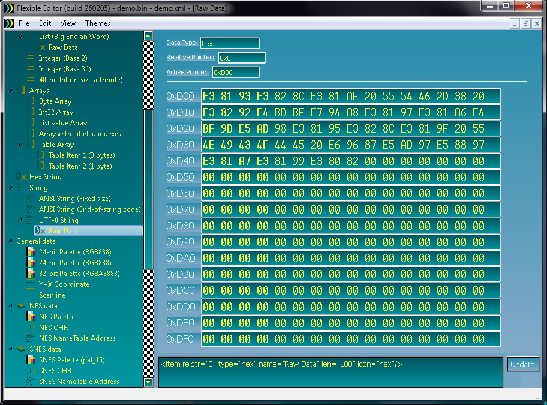
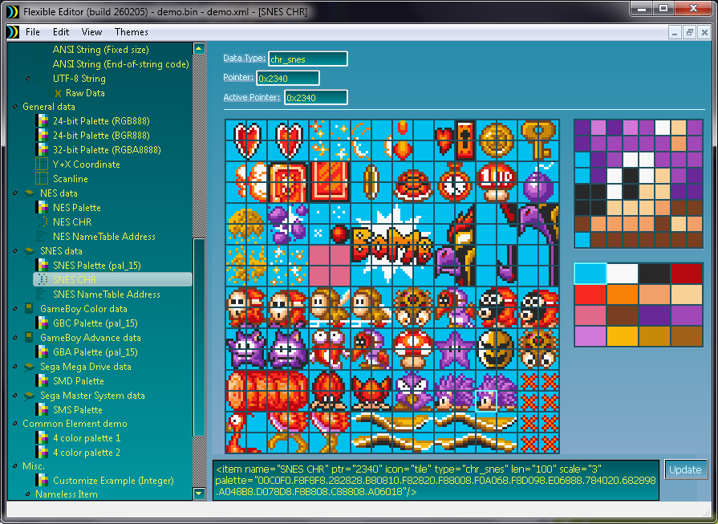

# Flexible Editor Readme

!!! NOTE: This program is still in early development. Please make backups! !!!

Flexible Editor is a project developed with the intention
of creating a general data editor for ROMs, ISOs and other files.
A general editor that is not restricted to one game or
one system.

The project is kind of a "reboot" of an old project/idea of mine
from 2005/2006 named DRDHack.

Flexible Editor can open any file as a Binary, including large ones in a "Write Buffer" mode.
To edit the loaded binary, a database is loaded or created in the form of an XML
document file that describes data locations, data types and other specifics.
XML files can be written by the users themselves, but the editor also
has some simple features now for creating and editing them.

When the editor is opened, it will load a demonstration XML and binary file.
You can start creating a new XML from File -> "New XML file.."

Check out "XML format.txt" for a guide on writing XML files.
Also, there are more example files in the XML subfolders.

The plan is to regularily update the project source code
and project components on Github.
You may find new or updated scripts for Data Types,
example XML files, as well as documentation on there before
it's shipped in a binary release.

I have typically released at least one "script update pack" between each main release.
These will be available here.

Flexible Editor is developed in C++ using Qt 4.8.0.

