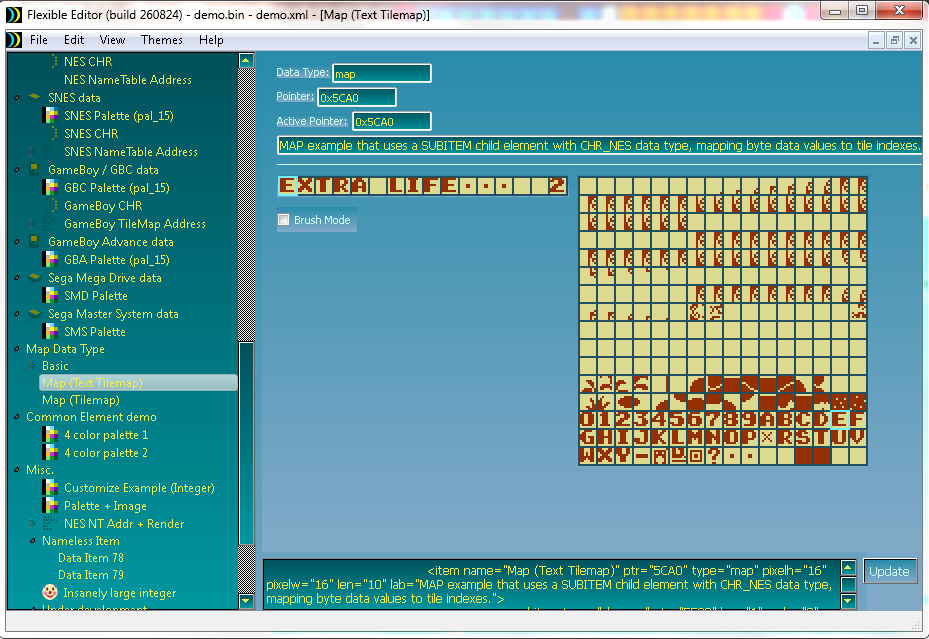
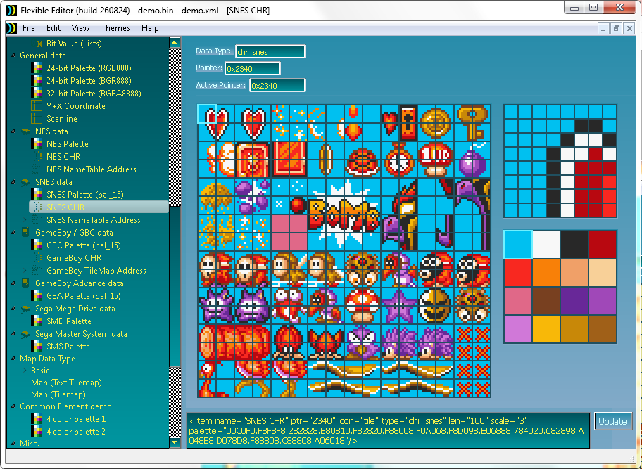
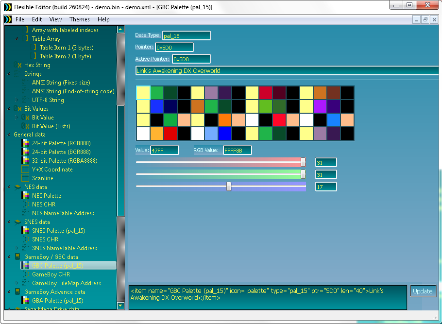

# Flexible Editor Readme

!!! NOTE: This program is still in early development. Please make backups! !!!

Flexible Editor is a project developed with the intention
of creating a general data editor for ROMs, ISOs and other files.
A general editor that is not restricted to one game or
one system, based on using XML documents to describe data
locations, data types and other specifics.
XML files can be written by the users themselves, but the editor also
has some simple features for creating and editing them.

Flexible Editor can open any file as a Binary, including large ones in a "Write Buffer" mode.

When the editor is opened, it will load a demonstration XML and binary file.
You can start creating a new XML from File -> "New XML file.."

Check out "XML format.txt" or "Full XML Documentation" from the Help menu
for a guide on writing XML files.
"Data Types Overview" in the Help menu gives a more quick and simple reference
of all data types and attributes that can be used.
There are also more example files in the XML subfolder.

The plan is to regularily update the project components on here.
You may find new or updated scripts for Data Types,
example XML files, as well as documentation on here before
it's shipped in a binary release.

I have typically released at least one "script update pack" between each main release.
These will be available here.

Flexible Editor is developed in C++ using Qt 4.8.0.

The project is based on an old project/idea of mine from 2005/2006 named DRDHack.

